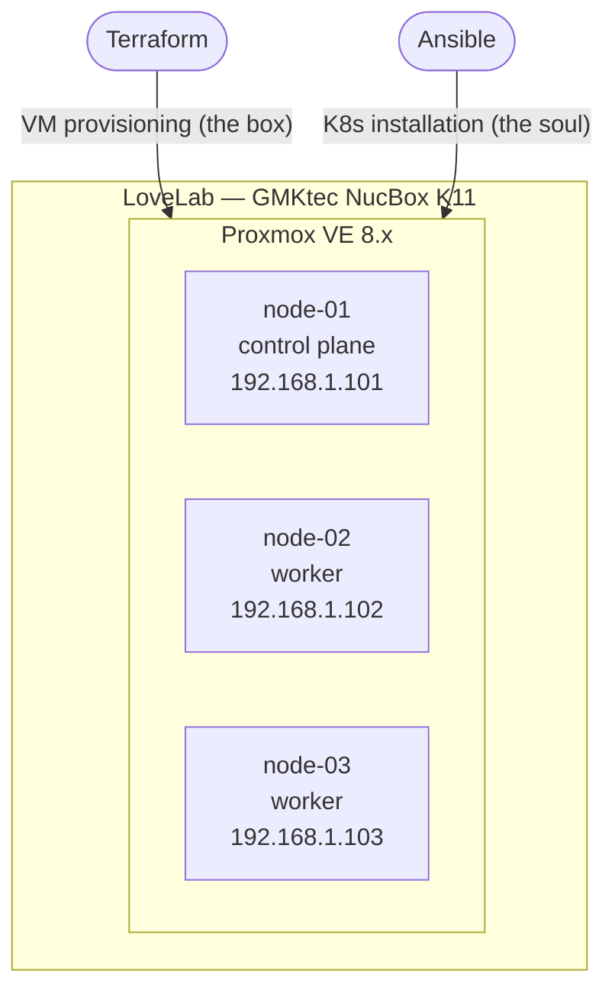
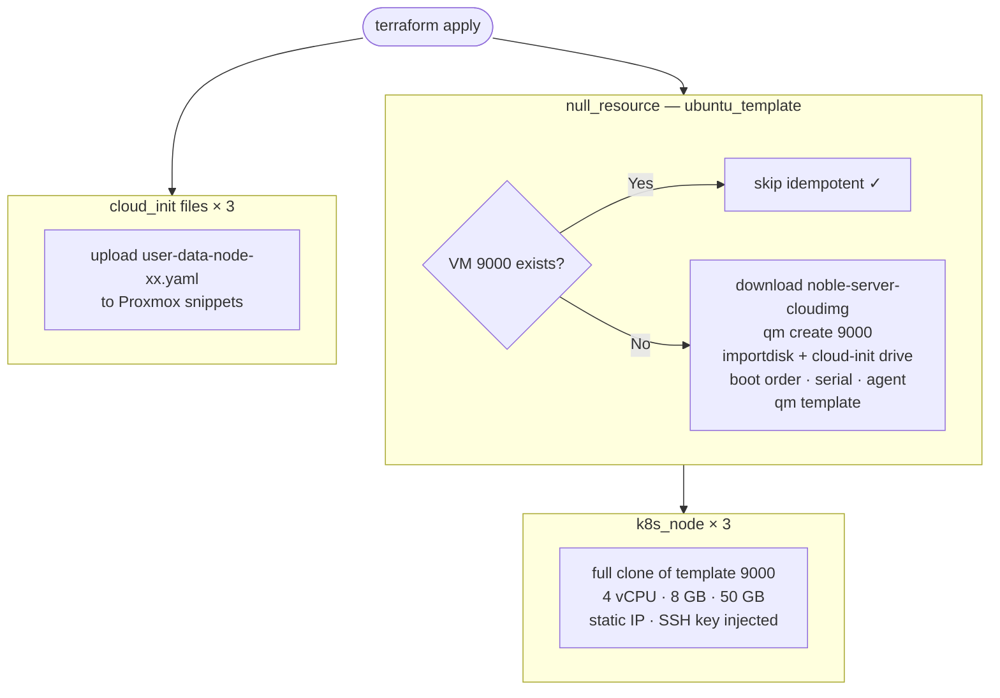
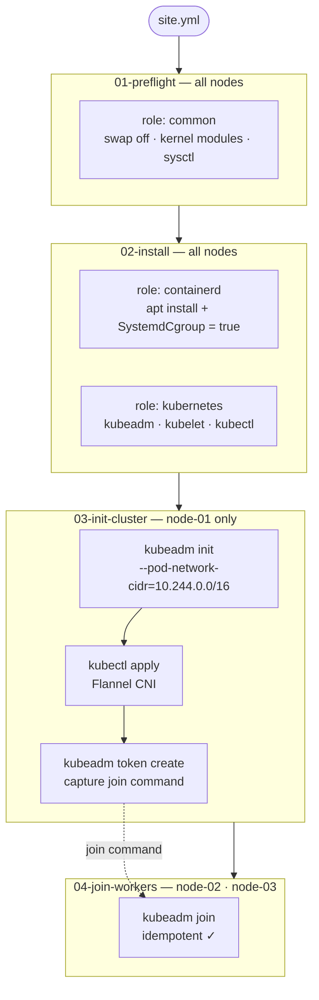
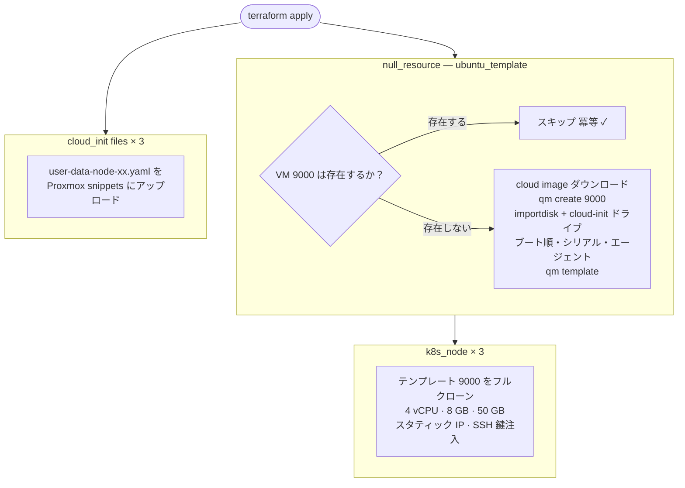
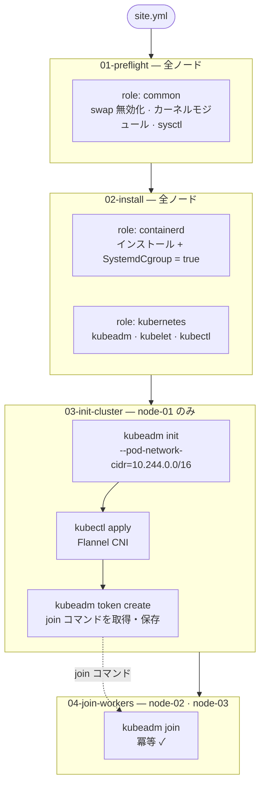

# LoveLab

> A fully automated Kubernetes homelab on Proxmox VE — provisioned with Terraform, configured with Ansible, launched with a single `make`.



---

## Table of Contents

- [Overview](#overview)
- [Hardware](#hardware)
- [Software Stack](#software-stack)
- [Network Design](#network-design)
- [Directory Structure](#directory-structure)
- [Prerequisites](#prerequisites)
- [Configuration](#configuration)
- [Usage](#usage)
- [How It Works](#how-it-works)
- [Roadmap](#roadmap)
- [References](#references)

---

## Overview

LoveLab is a fully automated, IaC-driven Kubernetes homelab running on a single bare-metal machine (GMKtec NucBox K11) via Proxmox VE. The design philosophy is **subtraction** — no unnecessary layers, no magic, every piece is readable and replaceable.

**What this repo gives you:**

- **One command** (`make`) to go from a fresh Proxmox install to a running 3-node Kubernetes cluster
- **Terraform** handles VM lifecycle: creates an Ubuntu 24.04 cloud image template if one doesn't exist, then clones it into 3 VMs with static IPs, cloud-init, and QEMU Guest Agent
- **Ansible** handles the K8s stack: containerd → kubeadm/kubelet/kubectl → `kubeadm init` on the control plane → Flannel CNI → worker joins
- **Idempotent**: re-running `make` is safe. Terraform skips existing resources; Ansible skips completed steps
- **Destroy and rebuild in minutes**: `make destroy && make` gives you a clean cluster

**Design decisions:**

| Decision | Choice | Reason |
|----------|--------|--------|
| Hypervisor | Proxmox VE | Free, mature, web UI + CLI, great VM template support |
| VM provisioner | Terraform (`bpg/proxmox`) | Declarative VM lifecycle, cloud-init injection |
| OS | Ubuntu 24.04 LTS | Long-term support, excellent Kubernetes support, cloud image available |
| Container runtime | containerd | The de-facto standard; what kubeadm expects |
| K8s distribution | kubeadm (vanilla K8s) | CKA exam parity; understand every moving part |
| CNI | Flannel | Minimal config, solid VXLAN overlay, easy to replace later |
| Config management | Ansible | Readable YAML, no agent required on nodes, battle-tested |

---

## Hardware

| Component | Spec |
|-----------|------|
| Machine | GMKtec NucBox K11 |
| CPU | AMD Ryzen 9 8945HS (8 cores / 16 threads, up to 5.2 GHz) |
| RAM | 32 GB DDR5 |
| Storage | 1 TB PCIe 4.0 NVMe SSD |
| Network | Dual 2.5 GbE (one for management, one for storage) |
| GPU expansion | OCuLink (PCIe x4) — future eGPU / AI workload |
| NAS | Synology DS218+ with 4 TB WD Red Plus (future persistent storage) |

**VM resource allocation:**

| Node | Role | vCPU | RAM | Disk | IP |
|------|------|------|-----|------|----|
| node-01 | control plane | 4 | 8 GB | 50 GB | 192.168.1.101 |
| node-02 | worker | 4 | 8 GB | 50 GB | 192.168.1.102 |
| node-03 | worker | 4 | 8 GB | 50 GB | 192.168.1.103 |

Allocation rationale:
- **vCPU**: 4 × 3 = 12 threads used (out of 16). 4 threads reserved for Proxmox host
- **RAM**: 8 × 3 = 24 GB used (out of 32 GB). 8 GB reserved for Proxmox + future VMs
- **Disk**: 50 × 3 = 150 GB used (out of 1 TB). Remaining ~818 GB available for Longhorn, etc.

---

## Software Stack

| Layer | Tool | Version |
|-------|------|---------|
| Hypervisor | Proxmox VE | 8.x |
| Guest OS | Ubuntu Server | 24.04 LTS (Noble) |
| Kubernetes | kubeadm / kubelet / kubectl | 1.31.x |
| Container runtime | containerd | 1.7.x |
| CNI | Flannel | latest |
| VM provisioner | Terraform (`bpg/proxmox`) | 1.9.x / ~0.61 |
| Config management | Ansible | 2.16.x |

---

## Network Design

```
Physical interfaces on NucBox K11
  enp1s0 → vmbr0  (192.168.1.0/24)    Management & Egress
  enp2s0 → vmbr1  (192.168.100.0/24)  Storage dedicated (no gateway) — Phase 3+

K8s node IPs (static via cloud-init, on vmbr0)
  node-01  192.168.1.101/24   gw: 192.168.1.1
  node-02  192.168.1.102/24   gw: 192.168.1.1
  node-03  192.168.1.103/24   gw: 192.168.1.1

K8s internal networks
  Pod CIDR     10.244.0.0/16   (Flannel default)
  Service CIDR 10.96.0.0/12    (kubeadm default)

Storage network (Phase 3+)
  vmbr1 → Synology DS218+ via direct 2.5GbE (no router hop)
```

The dual 2.5 GbE NICs allow physical separation of management traffic (K8s API, SSH, internet) and storage traffic (NFS/iSCSI to DS218+), preventing storage I/O from saturating the management network.

---

## Directory Structure

```
lovelab/
├── Makefile                          # Entry point — make / make vm / make k8s
├── .gitignore
│
├── terraform/
│   ├── providers.tf                  # bpg/proxmox provider config
│   ├── variables.tf                  # All input variables
│   ├── main.tf                       # null_resource (template) + VM × 3 + cloud-init files
│   ├── outputs.tf                    # Outputs node IPs
│   ├── terraform.tfvars.example      # Copy to terraform.tfvars and fill in
│   ├── scripts/
│   │   └── create-template.sh        # Idempotent Ubuntu 24.04 template creator
│   └── cloud-init/
│       └── user-data.yaml.tpl        # Sets hostname, installs qemu-guest-agent
│
└── ansible/
    ├── ansible.cfg                   # Inventory path, SSH settings, output format
    ├── site.yml                      # Master playbook — imports 01 through 04
    ├── inventory/
    │   └── hosts.yml                 # node-01 (control plane), node-02/03 (workers)
    ├── group_vars/
    │   ├── all.yml                   # k8s_version, pod_cidr, SSH key path
    │   └── k8s_workers.yml           # Worker-specific vars (placeholder)
    ├── roles/
    │   ├── common/tasks/main.yml     # swap off, kernel modules, sysctl
    │   ├── containerd/tasks/main.yml # containerd install + SystemdCgroup
    │   └── kubernetes/tasks/main.yml # kubeadm, kubelet, kubectl
    └── playbooks/
        ├── 01-preflight.yml          # Applies role: common
        ├── 02-install.yml            # Applies roles: containerd, kubernetes
        ├── 03-init-cluster.yml       # kubeadm init, Flannel, capture join command
        └── 04-join-workers.yml       # kubeadm join on node-02 and node-03
```

---

## Prerequisites

### On the Proxmox host

- Proxmox VE 8.x installed on bare metal
- Internet access (to download the Ubuntu cloud image)
- SSH access as `root` from your local machine
- `local` storage has **Snippets** enabled
  - `Datacenter → Storage → local → Edit → Content → add Snippets`

### On your local machine

- [Terraform](https://developer.hashicorp.com/terraform/install) 1.9+
- [Ansible](https://docs.ansible.com/ansible/latest/installation_guide/) 2.16+
- An SSH key pair at `~/.ssh/id_ed25519` (or adjust `proxmox_ssh_key` in `terraform.tfvars`)

---

## Configuration

Copy the example tfvars and fill in your values:

```bash
cp terraform/terraform.tfvars.example terraform/terraform.tfvars
```

```hcl
# terraform/terraform.tfvars

proxmox_endpoint = "https://192.168.1.x:8006"   # Your Proxmox host URL
proxmox_username = "root@pam"
proxmox_password = "your-proxmox-password"
proxmox_host_ip  = "192.168.1.x"                 # Same host, used for SSH (template creation)
proxmox_ssh_key  = "~/.ssh/id_ed25519"            # Private key for SSH to Proxmox
ssh_public_key   = "ssh-ed25519 AAAA..."          # Public key injected into VMs via cloud-init
```

> `terraform.tfvars` is in `.gitignore` — it will never be committed.

**If your network uses different IPs**, edit these files before running:

| File | What to change |
|------|---------------|
| `terraform/variables.tf` | `nodes` default map (VM IPs) and `gateway` |
| `ansible/inventory/hosts.yml` | `ansible_host` for each node |
| `ansible/group_vars/all.yml` | `pod_cidr` if you want a different overlay range |

---

## Usage

```bash
cd /path/to/lovelab

# Full deploy from scratch: VM provisioning + K8s cluster setup
make

# Individual steps
make vm       # Terraform: create template (if needed) + clone 3 VMs
make k8s      # Ansible: install and initialize the K8s cluster
make ping     # Ansible: verify SSH connectivity to all nodes
make destroy  # Terraform: destroy all 3 VMs (template is preserved)
```

After `make` completes, SSH into the control plane to verify:

```bash
ssh ubuntu@192.168.1.101

kubectl get nodes
# NAME      STATUS   ROLES           AGE   VERSION
# node-01   Ready    control-plane   Xm    v1.31.x
# node-02   Ready    <none>          Xm    v1.31.x
# node-03   Ready    <none>          Xm    v1.31.x
```

---

## How It Works

### Phase 1 — `make vm` (Terraform)



### Phase 2 — `make k8s` (Ansible)



---

## Roadmap

| Phase | Feature |
|-------|---------|
| **Current** | 3-node K8s cluster (1 control plane + 2 workers) |
| Phase 2 | MetalLB — bare-metal LoadBalancer IP pool |
| Phase 2 | Ingress-NGINX — HTTP/HTTPS routing |
| Phase 3 | Longhorn — distributed block storage (PVC) |
| Phase 3 | ArgoCD — GitOps application delivery |
| Phase 4 | Terraform remote state on self-hosted Minio |
| Phase 4 | Synology CSI Driver — NFS/iSCSI persistent volumes from DS218+ |
| Phase 5 | eGPU via OCuLink — Ollama / local LLM inference |

---

## References

- [khuedoan/homelab](https://github.com/khuedoan/homelab) — PXE boot bare-metal provisioning + ArgoCD GitOps. Source of the Makefile-as-entrypoint pattern.
- [ricsanfre/pi-cluster](https://github.com/ricsanfre/pi-cluster) — Raspberry Pi + x86 hybrid cluster with Ansible + FluxCD. Detailed role structure reference.
- [bpg/terraform-provider-proxmox](https://github.com/bpg/terraform-provider-proxmox) — The Proxmox Terraform provider used in this repo.
- [Proxmox VE Documentation](https://pve.proxmox.com/pve-docs/)
- [kubeadm Installation Guide](https://kubernetes.io/docs/setup/production-environment/tools/kubeadm/)
- [Flannel CNI](https://github.com/flannel-io/flannel)

---

---

# LoveLab（日本語）

> Proxmox VE 上に構築する、フル自動化 Kubernetes ホームラボ。Terraform で箱を作り、Ansible で魂を入れ、`make` 一発で起動する。

---

## 目次

- [概要](#概要)
- [ハードウェア](#ハードウェア)
- [ソフトウェアスタック](#ソフトウェアスタック)
- [ネットワーク設計](#ネットワーク設計)
- [ディレクトリ構成](#ディレクトリ構成)
- [前提条件](#前提条件)
- [設定](#設定)
- [使い方](#使い方)
- [仕組み](#仕組み)
- [ロードマップ](#ロードマップ)
- [参考リポジトリ](#参考リポジトリ)

---

## 概要

LoveLab は、GMKtec NucBox K11 の単一ベアメタルマシン上で Proxmox VE を動かし、その上に 3 ノードの Kubernetes クラスタを構築する IaC プロジェクト。設計思想は**引き算の美学** — 不要なレイヤーを排除し、すべてのコードが読めて、交換できる状態を保つ。

**このリポジトリが提供するもの：**

- Proxmox をインストールした状態から `make` 一発で K8s クラスタが立ち上がる
- **Terraform** が VM ライフサイクルを管理：Ubuntu 24.04 cloud image のテンプレートを作成し、3 台の VM としてクローンする
- **Ansible** が K8s スタックを構成：containerd → kubeadm/kubelet/kubectl → `kubeadm init` → Flannel CNI → worker join
- **冪等性**：`make` を何度実行しても安全。既存リソースはスキップされる
- **壊して作り直せる**：`make destroy && make` で数分以内にクリーンなクラスタが復元できる

**設計上の判断：**

| 判断ポイント | 選択 | 理由 |
|------------|------|------|
| ハイパーバイザー | Proxmox VE | 無料・成熟・Web UI + CLI・テンプレート機能が優秀 |
| VM プロビジョナー | Terraform (`bpg/proxmox`) | 宣言的な VM ライフサイクル管理・cloud-init 注入 |
| OS | Ubuntu 24.04 LTS | 長期サポート・K8s サポートが厚い・cloud image が公式提供 |
| コンテナランタイム | containerd | 事実上の標準；kubeadm が期待するランタイム |
| K8s ディストリ | kubeadm（バニラ K8s） | CKA 試験環境と一致；内部の動きをすべて理解できる |
| CNI | Flannel | 設定最小・安定した VXLAN オーバーレイ・後から交換しやすい |
| 構成管理 | Ansible | 読みやすい YAML・ノードへのエージェント不要・実績豊富 |

---

## ハードウェア

| コンポーネント | スペック |
|-------------|---------|
| マシン | GMKtec NucBox K11 |
| CPU | AMD Ryzen 9 8945HS（8コア / 16スレッド、最大 5.2 GHz） |
| RAM | 32 GB DDR5 |
| ストレージ | 1 TB PCIe 4.0 NVMe SSD |
| ネットワーク | Dual 2.5 GbE（管理用・ストレージ用で分離） |
| GPU 拡張 | OCuLink（PCIe x4）— 将来の eGPU / AI ワークロード用 |
| NAS | Synology DS218+（WD Red Plus 4TB）— 将来の永続ストレージ |

**VM リソース配分：**

| ノード | 役割 | vCPU | RAM | Disk | IP |
|--------|------|------|-----|------|----|
| node-01 | コントロールプレーン | 4 | 8 GB | 50 GB | 192.168.1.101 |
| node-02 | ワーカー | 4 | 8 GB | 50 GB | 192.168.1.102 |
| node-03 | ワーカー | 4 | 8 GB | 50 GB | 192.168.1.103 |

配分の根拠：
- **vCPU**：4 × 3 = 12 スレッド使用（16T 中）。Proxmox ホスト用に 4T 確保
- **RAM**：8 × 3 = 24 GB 使用（32GB 中）。Proxmox OS + 将来 VM 用に 8GB 余裕
- **Disk**：50 × 3 = 150 GB 使用（1TB 中）。残 ~818 GB は Longhorn 等に転用可

---

## ソフトウェアスタック

| レイヤー | ツール | バージョン |
|---------|------|----------|
| ハイパーバイザー | Proxmox VE | 8.x |
| ゲスト OS | Ubuntu Server | 24.04 LTS（Noble） |
| Kubernetes | kubeadm / kubelet / kubectl | 1.31.x |
| コンテナランタイム | containerd | 1.7.x |
| CNI | Flannel | latest |
| VM プロビジョナー | Terraform（`bpg/proxmox`） | 1.9.x / ~0.61 |
| 構成管理 | Ansible | 2.16.x |

---

## ネットワーク設計

```
NucBox K11 の物理インターフェース
  enp1s0 → vmbr0  (192.168.1.0/24)    管理 & Egress
  enp2s0 → vmbr1  (192.168.100.0/24)  ストレージ専用（ゲートウェイなし）— Phase 3+

K8s ノード IP（cloud-init でスタティック設定、vmbr0 上）
  node-01  192.168.1.101/24   gw: 192.168.1.1
  node-02  192.168.1.102/24   gw: 192.168.1.1
  node-03  192.168.1.103/24   gw: 192.168.1.1

K8s 内部ネットワーク
  Pod CIDR     10.244.0.0/16   （Flannel のデフォルト）
  Service CIDR 10.96.0.0/12    （kubeadm のデフォルト）

ストレージネットワーク（Phase 3+）
  vmbr1 → Synology DS218+ を 2.5GbE 直結（ルーター非経由）
```

Dual 2.5 GbE NIC により、管理トラフィック（K8s API、SSH、インターネット）とストレージトラフィック（DS218+ への NFS/iSCSI）を物理的に分離できる。ストレージ I/O が管理ネットワークを圧迫しない設計。

---

## ディレクトリ構成

```
lovelab/
├── Makefile                          # エントリポイント — make / make vm / make k8s
├── .gitignore
│
├── terraform/
│   ├── providers.tf                  # bpg/proxmox プロバイダ設定
│   ├── variables.tf                  # 全入力変数の定義
│   ├── main.tf                       # null_resource（テンプレート）+ VM × 3 + cloud-init ファイル
│   ├── outputs.tf                    # ノード IP を出力
│   ├── terraform.tfvars.example      # これを terraform.tfvars にコピーして記入
│   ├── scripts/
│   │   └── create-template.sh        # 冪等な Ubuntu 24.04 テンプレート作成スクリプト
│   └── cloud-init/
│       └── user-data.yaml.tpl        # ホスト名設定・qemu-guest-agent インストール
│
└── ansible/
    ├── ansible.cfg                   # インベントリパス・SSH 設定・出力フォーマット
    ├── site.yml                      # マスタープレイブック（01〜04 をインポート）
    ├── inventory/
    │   └── hosts.yml                 # node-01（コントロールプレーン）、node-02/03（ワーカー）
    ├── group_vars/
    │   ├── all.yml                   # k8s_version、pod_cidr、SSH 鍵パス
    │   └── k8s_workers.yml           # ワーカー固有変数（プレースホルダー）
    ├── roles/
    │   ├── common/tasks/main.yml     # swap 無効化・カーネルモジュール・sysctl
    │   ├── containerd/tasks/main.yml # containerd インストール + SystemdCgroup 設定
    │   └── kubernetes/tasks/main.yml # kubeadm・kubelet・kubectl インストール
    └── playbooks/
        ├── 01-preflight.yml          # role: common を適用
        ├── 02-install.yml            # role: containerd、kubernetes を適用
        ├── 03-init-cluster.yml       # kubeadm init・Flannel・join コマンド取得
        └── 04-join-workers.yml       # node-02・03 をクラスタに join
```

---

## 前提条件

### Proxmox ホスト側

- Proxmox VE 8.x がベアメタルにインストール済み
- インターネット接続（Ubuntu cloud image のダウンロードに使用）
- ローカルマシンから `root` で SSH できること
- `local` ストレージの **Snippets** が有効化されていること
  - `Datacenter → Storage → local → Edit → Content → Snippets を追加`

### ローカルマシン側

- [Terraform](https://developer.hashicorp.com/terraform/install) 1.9+
- [Ansible](https://docs.ansible.com/ansible/latest/installation_guide/) 2.16+
- SSH 鍵ペアが `~/.ssh/id_ed25519` に存在すること（パスを変える場合は `terraform.tfvars` の `proxmox_ssh_key` を変更）

---

## 設定

tfvars のサンプルをコピーして実際の値を記入する：

```bash
cp terraform/terraform.tfvars.example terraform/terraform.tfvars
```

```hcl
# terraform/terraform.tfvars

proxmox_endpoint = "https://192.168.1.x:8006"   # Proxmox ホストの URL
proxmox_username = "root@pam"
proxmox_password = "your-proxmox-password"
proxmox_host_ip  = "192.168.1.x"                 # テンプレート作成用 SSH 接続先（同じホスト）
proxmox_ssh_key  = "~/.ssh/id_ed25519"            # Proxmox への SSH 秘密鍵パス
ssh_public_key   = "ssh-ed25519 AAAA..."          # VM に cloud-init で注入する公開鍵
```

> `terraform.tfvars` は `.gitignore` に含まれており、コミットされることはない。

**ネットワークの IP が異なる場合**、実行前に以下を変更する：

| ファイル | 変更箇所 |
|---------|---------|
| `terraform/variables.tf` | `nodes` のデフォルト IP マップと `gateway` |
| `ansible/inventory/hosts.yml` | 各ノードの `ansible_host` |
| `ansible/group_vars/all.yml` | `pod_cidr`（オーバーレイネットワークのレンジを変えたい場合） |

---

## 使い方

```bash
cd /path/to/lovelab

# 更地から K8s クラスタを完全構築（VM プロビジョニング + K8s セットアップ）
make

# 個別実行
make vm       # Terraform：テンプレート作成（必要な場合のみ）+ VM 3 台をクローン
make k8s      # Ansible：K8s クラスタのインストールと初期化
make ping     # Ansible：全ノードへの SSH 疎通確認
make destroy  # Terraform：VM 3 台を全削除（テンプレートは保持）
```

`make` 完了後、コントロールプレーンにログインして確認：

```bash
ssh ubuntu@192.168.1.101

kubectl get nodes
# NAME      STATUS   ROLES           AGE   VERSION
# node-01   Ready    control-plane   Xm    v1.31.x
# node-02   Ready    <none>          Xm    v1.31.x
# node-03   Ready    <none>          Xm    v1.31.x
```

---

## 仕組み

### Phase 1 — `make vm`（Terraform）



### Phase 2 — `make k8s`（Ansible）



---

## ロードマップ

| フェーズ | 内容 |
|---------|------|
| **現在** | 3 ノード K8s クラスタ（コントロールプレーン 1 台 + ワーカー 2 台） |
| Phase 2 | MetalLB — ベアメタル環境での LoadBalancer IP プール |
| Phase 2 | Ingress-NGINX — HTTP/HTTPS ルーティング |
| Phase 3 | Longhorn — 分散ブロックストレージ（PVC） |
| Phase 3 | ArgoCD — GitOps アプリケーションデリバリー |
| Phase 4 | Terraform リモートステートをセルフホスト Minio に移行 |
| Phase 4 | Synology CSI Driver — DS218+ から NFS/iSCSI で永続ボリュームを提供 |
| Phase 5 | OCuLink 経由の eGPU — Ollama / ローカル LLM 推論 |

---

## 参考リポジトリ

- [khuedoan/homelab](https://github.com/khuedoan/homelab) — PXE ブートによるベアメタル自動プロビジョニング + ArgoCD GitOps。Makefile をエントリポイントとするパターンの参考元。
- [ricsanfre/pi-cluster](https://github.com/ricsanfre/pi-cluster) — Raspberry Pi + x86 ハイブリッドクラスタ。Ansible + FluxCD。ロール構造の参考。
- [bpg/terraform-provider-proxmox](https://github.com/bpg/terraform-provider-proxmox) — 本リポジトリで使用している Proxmox Terraform プロバイダ。
- [Proxmox VE ドキュメント](https://pve.proxmox.com/pve-docs/)
- [kubeadm インストールガイド](https://kubernetes.io/docs/setup/production-environment/tools/kubeadm/)
- [Flannel CNI](https://github.com/flannel-io/flannel)
